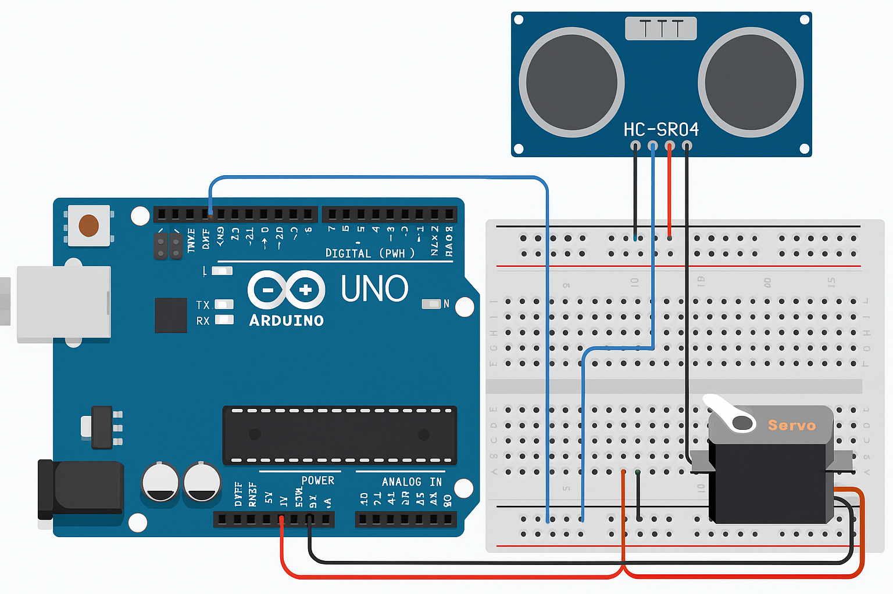

# Ultrasonic-Radar-Scanner
An Arduino-based radar system using ultrasonic sensor, servo motor and Processing GUI

This project creates a radar-like object detection system using:
- HC-SR04 Ultrasonic Sensor
- SG90 Servo Motor
- Arduino UNO
- Processing for live GUI display

## 🔧 Features

- 180° scanning using servo
- Real-time distance data from ultrasonic sensor
- Radar-style GUI built using Processing
- Serial communication between Arduino and PC

## 🖥️ Project Components

- **Arduino UNO**
- **HC-SR04 Ultrasonic Sensor**
- **SG90 Micro Servo**
- **Processing IDE** (for graphical interface)

## 🧪 How It Works

1. The servo rotates from 15° to 165° and back.
2. At each degree, the ultrasonic sensor measures distance.
3. Distance and angle are sent to the PC via Serial.
4. Processing reads serial data and plots the radar in real time.

## 📁 File Structure

- `Arduino_Code/radar_scanner.ino` — Arduino program
- `Processing_GUI/radar_gui.pde` — Processing GUI script
- `wiring_diagram.png` — Circuit diagram
- `README.md` — This file

## 📷 Wiring Diagram

## 🧑‍💻 Made by

> Deepak Kumawat – M.Tech in Machine Design, IIT Kharagpur  
> 🔗 YouTube: [The IITian DPK](https://www.youtube.com/@TheIITianDPK)

## 📜 License

MIT License
